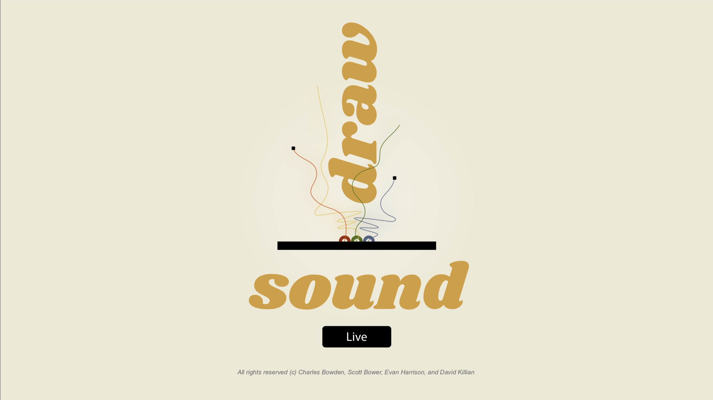

# Draw <--> Sound <--> Live

## About

Sound><Art is an application that allows users to either perform, or watch the performance of, a user who draws music and sound. That is, they create a sound performance by doing art and drawing with their mouse. Our digital space is inspired by [Soundspace at Durham Science Museum](https://www.lifeandscience.org/soundspace), which merges movement, sound, and visual art. 

The app provides an endless participatory experience in which performers interact with the canvas DOM. They have a canvas on the screen--an instrument--which allows them to manipulate a sound track and generate sound based on input events (eg. mouse location, direction, velocity) which is both seen and heard by viewers. Each movement is drawn and viewable. The underlying rules are not explicit to the users. Simply, they are sketching “music”.

Viewers can rate and comment on the performance. Performers stats (eg. # of performances, ratings) are displayed.

## Application
The main landing page of the app has a "Live" button, which re-directs the user to Google Authenticaion screen to validate their credentials. 

**Main screen of Draw <--> Sound <--> Live**


The user is then directed to the Venue.  In the venue there are several 


## Components

### 


### Google Signin


## Running the App

You can run a hosted version on Heroku [here](https://nameless-falls-98591.herokuapp.com/). 

Alternatively you can install and run the app locally.  Do do this, first you have to clone the git repo and then install.

```
git clone https://github.com/DSEapps/draw-sound-live.git
cd draw-sound-live
yarn install
cd client
yarn install
cd ..
```

After both installations complete, run the following command in your terminal:

```
yarn start
```

That's it, your app should be running on <https://localhost:3000>. The server will proxy requests from the client on <https://localhost:3001>.  To simulate multiple clients, open additional broswer tabs to view performances or get on the stage.


