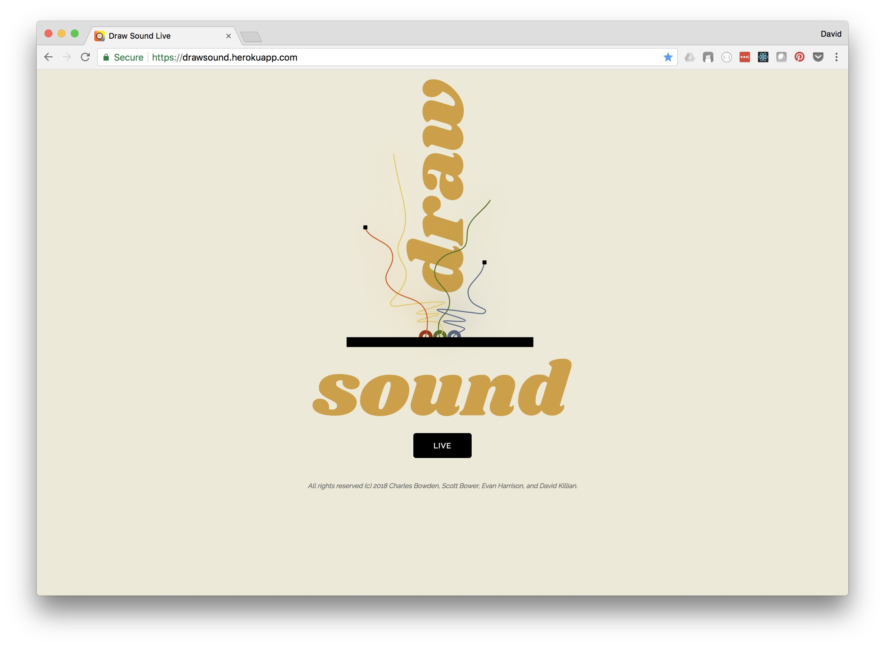

# Draw <--> Sound <--> Live

## About

Sound><Art is an application that allows users to either perform, or watch the performance of, a user who draws music and sound. That is, they create a sound performance by doing art and drawing with their mouse. Our digital space is inspired by [Soundspace at Durham Science Museum](https://www.lifeandscience.org/soundspace), which merges movement, sound, and visual art. 

The app provides an endless participatory experience in which performers interact with the canvas DOM. They have a canvas on the screen--an instrument--which allows them to manipulate a sound track and generate sound based on input events (eg. mouse location, direction, velocity) which is both seen and heard by viewers. Each movement is drawn and viewable. The underlying rules are not explicit to the users. Simply, they are sketching “music”.

Viewers can rate and comment on the performance. Performers stats (eg. # of performances, ratings) are displayed.

## Application
The main landing page of the app has a "Live" button, which re-directs the user to Google Authenticaion screen to validate their credentials. 

**Landing Page of Draw <--> Sound <--> Live**


The login page will offer an options to proceed.

**Authentication Page of Draw <--> Sound <--> Live**


Once authenticated, the user is then directed to the Venue.  In the venue the user is presented with the stage, a chat area and a button "Get On Stage" to allow any audience member to perform.

**In the Venue, waiting for Performer**


If an audience member decides to get on stage, they can then explore the canvas and keyboard and begin to create.  Draw.  Sound.  Live.

During the performance, the audience members can chat, boo or cheer the performance.  This info persists with the performer, and at the end of the performance is added to their lifetime totals.

**On Stage, Draw. Sound. Live.**


## Design

Behind the scenes there are many moving parts.  The venue contains various components that interact with eachother.  The primary component is the canvas, which is the source of visual and audio "art".  The performer is invited to explore the possibilities of the stage and the "instruments" that are hidden within.

During the performance, the audience is encouraged to express their emotions, via applause or booing.  And they can even comment to fellow travelers via chat.


Looking deeper within the app, there is bi-directional, event-based realtime communications that enable the performer to project their performance to the audience, and for the audience to express their sentiment back to the performer.


The application is based on React, which encourages reusable UI components with dynamically rendered data.  To better understand the organization, the app has a root, called App, which has 3 main components: Login, Landing and Venue.  Within this structure the state of the app is managed.
  


## Running the App

You can run a hosted version on Heroku [here](https://drawsound.herokuapp.com/). 

Alternatively you can install and run the app locally.  Do do this, first you have to clone the git repo and then install.

```
git clone https://github.com/DSEapps/draw-sound-live.git
cd draw-sound-live
yarn install
cd client
yarn install
cd ..
```

After both installations complete, run the following command in your terminal:

```
yarn start
```

That's it, your app should be running on <https://localhost:3000>. The server will proxy requests from the client on <https://localhost:3001>.  To simulate multiple clients, open additional broswer tabs to view performances or get on the stage.


