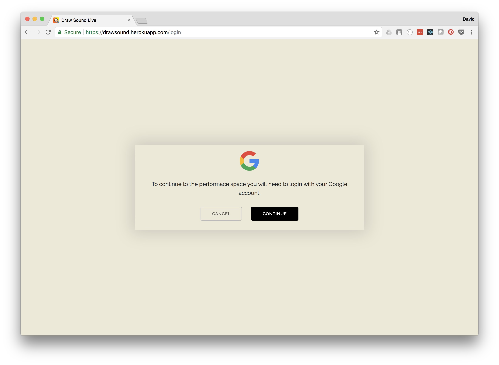
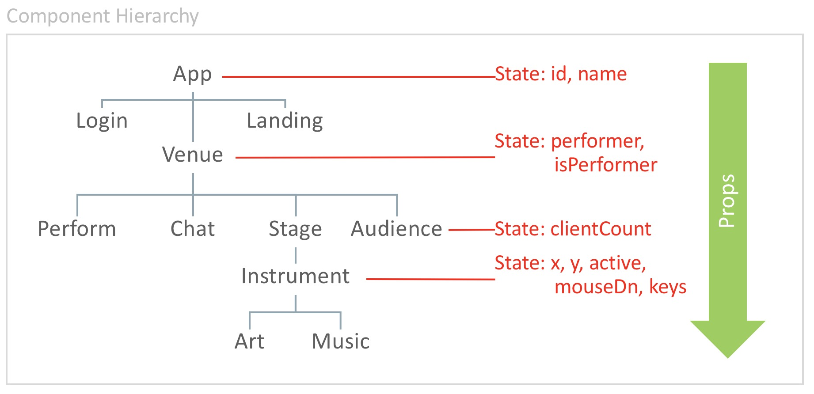

# Draw <--> Sound <--> Live

Draw <--> Sound <--> Live is an application that allows users to either perform, or watch the performance of, a user who draws music and sound. That is, they create a sound performance by doing art and drawing with their mouse. Our digital space is inspired by [Soundspace at Durham Science Museum](https://www.lifeandscience.org/soundspace), which merges movement, sound, and visual art.


The app provides an endless participatory experience in which performers interact with the canvas DOM. They have a canvas on the screen--an instrument--which allows them to manipulate a sound track and generate sound based on input events (eg. mouse location, direction, velocity) which is both seen and heard by viewers. Each movement is drawn and viewable. The underlying rules are not explicit to the users. Simply, they are sketching “music”.

Viewers can rate and comment on the performance. Performers stats (eg. # of performances, ratings) are displayed.

## Application
The main landing page of the app has a "Live" button, which re-directs the user to Google Authenticaion screen to validate their credentials. 

**Landing Page of Draw <--> Sound <--> Live**


The login page will offer an options to proceed.

**Authentication Page of Draw <--> Sound <--> Live**


Once authenticated, the user is then directed to the Venue.  In the venue, the user is presented with the stage, a chat area and a button "Get On Stage" to allow any audience member to perform.

**In the Venue, waiting for Performer**


If an audience member decides to get on stage, they can then explore the canvas and keyboard and begin to create.  Draw.  Sound.  Live.

During the performance, the audience is encouraged to express their feelings/emotions via applause, booing or chat.  This info persists with the performer, and at the end of the performance is added to their lifetime totals.  Note that performers that receive too many "boos" are kicked off stage.

**On Stage, Draw. Sound. Live.**


## Design

Behind the scenes there are many moving parts.  The venue contains various components that interact with eachother.  The primary composition element is the canvas.  It renders the performer's mouse movements into a drawing that manipulates settings of the sound effects.  The result is a continously evolving visual-musical performance art experience, where the performer is invited to explore the possibilities of the canvas and the "instruments" that are hidden within. 


Looking deeper within the app, socket.io is used for bi-directional, event-based realtime communications which enable the performer to project their performance to the audience.  It also provides a means for chat, so the audience can have an ongoing discussion and convey their sentiments.


The application is based on React, which encourages reusable UI components with dynamically rendered views.  To better understand the organization, the app has a root, called App, which has 3 main components: Login, Landing and Venue.  Within this structure the state of the participants and their interactions is managed.




## Running the App

You can run a hosted version on Heroku [here](https://drawsound.herokuapp.com/). 

Alternatively you can install and run the app locally.  Do do this, first you have to clone the git repo and then install.

```
git clone https://github.com/DSEapps/draw-sound-live.git
cd draw-sound-live
yarn install
cd client
yarn install
cd ..
```

Next, MongoDB is required for user data.  Install requires the following:

For Mac:
```
brew install mongodb
```
Open two separate terminals and type in the first terminal:
```
mongod
```
Type the following in the second:
```
mongo
```

Note:  You will need to include a .env file in your root directory with GOOGLE_CLIENT_ID & GOOGLE_CLIENT_SECRET variables which will need to be obtained from Google.  You will also need to specify in your Google Dev Dashboard the origin and callback routes from the application.


After both installations complete, run the following command in your terminal:

```
yarn start
```

That's it, your app should be running on <https://localhost:3000>. The server will proxy requests from the client on <https://localhost:3001>.  To simulate multiple clients, open additional broswer tabs to view performances or get on the stage.

## Adding Custom Music

(Note, this project is forked in order to include custom music.) If you install Draw Sound Live properly using the instructions below and then navigate through this file path `draw-sound-live/client/src/components/Venue/Stage/` you can find the Songs folder. Put your song (your-song.mp3) in the Songs folder, then edit `Stage.js`. Above the `audioURLS` variable on line 5 write `import YourSong from "./Songs/your-song.mp3"` replacing your-song.mp3 with the song of your choosing. Inside of audioURLS, add `YourSong` to the array. Then, staying inside the `Stage.js` file, press `control-f / command-f` and type in `audioURLS` to find where the array is referenced. Enter the index at which `YourSong` exists in the array. After following these steps, you should be able to input your own custom song.

## MERN Basic Components

Our application starts off with the basic MERN components (MongoDB, Express, React and Node).

References: 
* [MongoDB](https://www.mongodb.com)
* [Express](https://expressjs.com)
* [React](https://reactjs.org/)
* [Node.js](https://nodejs.org/en/)

### Authentication

Our application just needed a basic authentication component as we're primarily interested in obtaining a user's name and a unique id for tracking the user's participation on our app.  We decided to accomplish this using Passport.js, Passport-Google-Oauth and React-Google-Login.

#### Passport.js
* [Passport.js](http://www.passportjs.org/)
* [Passport-Google-Oauth](https://www.npmjs.com/package/passport-google-oauth)

#### Google-React-Login
* [Google-React-Login](https://www.npmjs.com/package/react-google-login)


### Other Technologies

In additional to MERN, Draw - Sound - Live also relied heavily on the following technologies for visual and audio affects.

* [Web Audio APIs](https://developer.mozilla.org/en-US/docs/Web/API/Web_Audio_API)
* [Socket.io](https://socket.io/)


